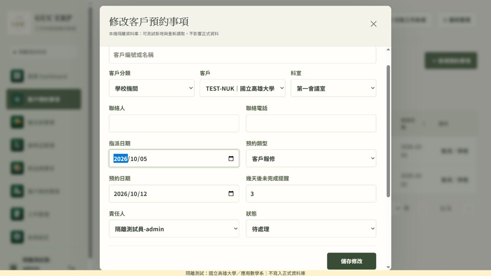
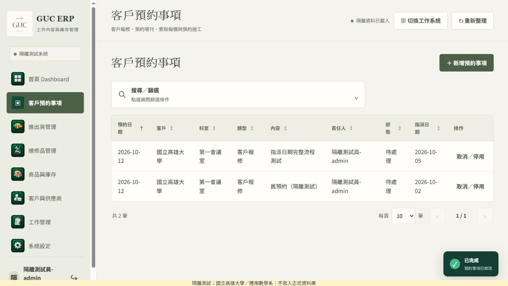

# 客戶預約事項：可編輯指派日期

日期：2026-10-07。狀態：本機完成，未推送／正式發布。

發布補記（2026-10-07）：使用者其後明確要求「發佈正式網站」，授權依下方 migration → Gateway → ERP 網站順序發布。本報告保留測試階段紀錄；實際發布結果另存發布紀錄。

## 範圍與來源

- 本次要求：「建立日期」改稱「指派日期」，新增及修改預約時皆可自行填寫。
- 維護來源：`Williams-CHEN0401/GUC-ERP`；本次已 fetch 查核的 `origin/main`：`136e8c961536dc7b6ceb192e011768bb45da7b65`（v1.26.0）。
- 開發分支：`codex/appointment-assigned-date-20261007`，由該 main 建立。
- 依維護規則保留原始 `created_at`，另用既有 `work_assignments` 的 `assigned_date` 保存業務日期，沒有新建主檔、Auth 或權限模型。
- 沒有變更其他網站、預約日期、提醒判斷、工作指派或取貨流程。

## 行為

- 清單「建立日期」改為「指派日期」，可直接點標題升降排序；排序值與畫面一致。
- 新增表單預設台灣今天，可手動填寫／選日期；修改表單顯示已保存的日期。空白及無效日期不可保存。
- 舊列尚無指派日期時顯示原建立時間的台灣日期；不批次回填、不修改原始建立時間。
- 舊版客戶端／RPC 未提供新欄位時保留既有日期；新增則預設台灣今天。舊列第一次保存時才補存原建立日。
- 取消及狀態異動不清空日期；舊 v1/v2 RPC 簽章及服務端權限沿用。v3 單次寫入與稽核，版本只遞增一次。

## 完整資料流及驗收

使用者在客戶預約清單新增或雙擊修改 → `saveAppointment` → `upsert_customer_appointment` Gateway → `upsert_customer_appointment_v3` → 隔離 PostgreSQL / 稽核 → appointments scope 重讀 → 清單呈現。

測試環境：同機 loopback，`scripts/appointment-assigned-date-fixture.mjs`，記憶體 PGlite、合成身份與資料；實際 Gateway handler 及 migration/RPC。沒有正式 DB／NAS 憑證、寫入或真實資料匯入。

測試網站：[客戶預約事項](http://127.0.0.1:4246/?page=appointments)。伺服器停止後合成資料會消失。

| 項目 | 證據與結果 |
|---|---|
| 新增 → 保存 | 瀏覽器指定指派日 2026-09-30、預約日 2026-10-12，清單正確顯示 |
| 雙擊修改 → 保存 → Reload → 重開 | 指派日期改為 2026-10-05，重讀仍為該日期，預約日及提醒 3 天不變 |
| 日期排序 | 指派日升冪：舊列 2026-10-02 → 新列 2026-10-05；降冪順序相反 |
| 空白日期 | 瀏覽器 required 驗證阻擋保存，valueMissing=true |
| 狀態保存 | 修改表單改「已取消」後日期仍為 2026-10-05，再改回待處理仍保留 |
| 舊列／台灣日期 | migration 前建立的合成舊列，新欄位仍 NULL；2026-10-01T17:30Z 顯示／首次保存為 2026-10-02 |
| API、SQL 保存／重讀 | `node scripts/verify-appointment-assigned-date-db.mjs` 通過 |
| 日期異常與競態 | 空白、2026-02-30、月份 13、年份 0000/10000、文字、舊版本、跨客戶科室均拒絕且列未改動 |
| 稽核與相容性 | 原 created_at 不變、每次僅一筆稽核與一個版本；舊 v1/v2、null／省略新欄位保留日期 |
| 既有指派回歸 | 最新 schema 上預約完成、非責任人拒絕、一般／取貨指派完成通過；一般與取貨指派沒有填入新日期 |
| 權限 | VIEW-only、私人客戶跨帳號拒絕；v3 SECURITY INVOKER、空 search_path，anon/authenticated 無 EXECUTE，僅 service_role 可呼叫 |
| 其他預約／存取回歸 | `node scripts/verify-access-appointments-db.mjs`，14 組通過 |
| 專案檢查 | `npm run check`：371/371 通過；`git diff --check` 通過 |
| 瀏覽器 | Codex IAB 桌面；新增／修改／重讀正常，error console 0 |

## 限制（未宣稱通過）

- `scripts/verify-appointments-db.mjs` 是較舊 fixture，沒有目前 Gateway 要求的 `customers.is_private`，在讀取時失敗；未擴大改寫此歷史測試。最新權限 fixture 的 14 組及本次新 integration suite 已通過，並另涵蓋舊 RPC、指派完成與取貨回歸。
- 清單「取消／停用」按鈕的 native confirm 在 IAB 自動化中逾時，未重送或宣稱該按鈕完成；重開清單確認未提交。改以既有修改表單選「已取消」完成瀏覽器狀態保存驗證，取消 API／日期保留另有 SQL 測試。未修改原 confirm 行為。
- 未測手機實機。沒有跑正式 Supabase Advisors／正式試寫；在隔離 DB 核對函式 catalog ACL、search_path 與拒絕路徑。PGlite 不等同完整 hosted Supabase。

## 待核准的正式發布範圍與順序

本次未收到正式發布授權，因此未 push、合併 main、部署 Gateway、套用正式 migration 或改環境變數。

需要一併確認的範圍：

1. 精確 migration：`20261006235526_customer_appointment_assigned_date.sql`（CLI 2.118.0 的 `migration new` 建立）。新增可空 date 欄位、約束與相容 RPC；無批次回填／刪除。
2. 部署本次 `inventory-gateway`，支持 `assigned_date` 日期驗證及 v3。
3. ERP 前端經 PR/CI/Preview 驗證後發布，順序為 migration → Gateway → 前端，避免新畫面先送出舊後端不認得的日期。

回復方式：前端/Gateway 可回復 v1.26.0 程式；保留新欄位及已保存資料。migration 向前相容 v1/v2，不用刪欄位或還原整庫。使用者無須自行輸入環境變數。

## 畫面

技術參考：[Supabase Database Functions](https://supabase.com/docs/guides/database/functions)。已查本次 changelog 的相關 breaking-change 標記；本次不涉及 extensions、Realtime、Auth 或 Management logs API 更動。
